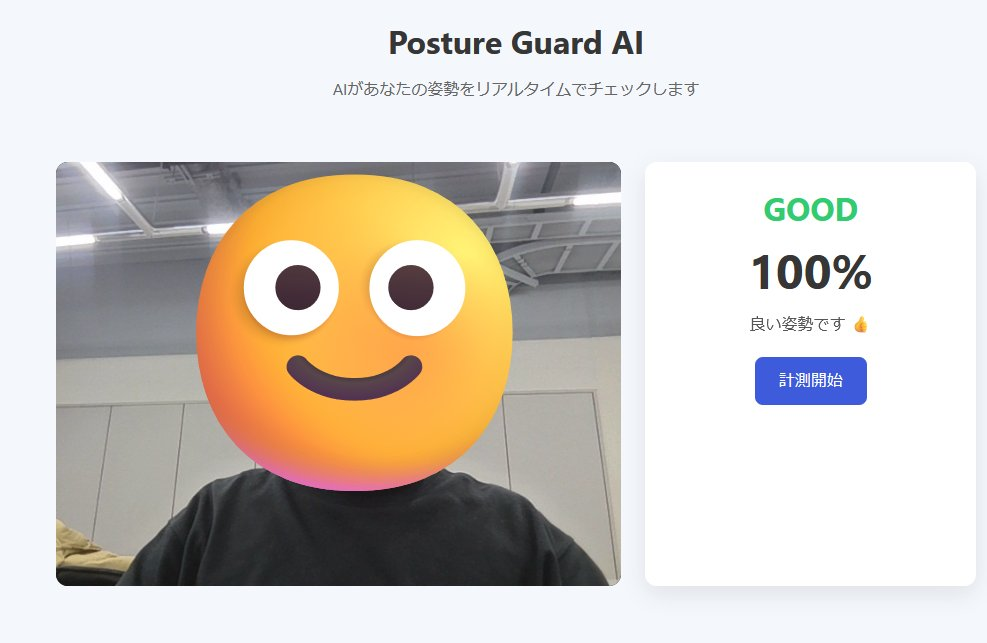

# Posture-Guard-AI 🧍‍♂️🛡️

**Posture-Guard-AI** は、カメラ映像から人の姿勢をリアルタイムに解析し、
猫背・首の前傾・体の傾きなどを検出してフィードバックする **姿勢チェック AI アプリ** です。

MediaPipe Pose を中心に、Web 技術（HTML / CSS / JavaScript）と Python バックエンドを組み合わせ、
「今どんな姿勢か」「どれくらい悪いか」を数値とメッセージで分かりやすく表示します。

---

## ✨ 主な機能

* 📷 **リアルタイム姿勢検出**
  カメラ映像から人体のランドマークを取得し、上半身姿勢を解析

* 📐 **姿勢角度の数値化**

  * 首の前傾角（CVA）
  * 上半身の前後傾
  * 肩の左右傾き

* 🧠 **姿勢スコアリング**
  姿勢を総合評価し、スコアとして表示

* 💬 **リアルタイムフィードバック**
  姿勢が崩れるとメッセージで注意喚起

* 🌐 **Web UI 対応**
  ブラウザ上で動作（インストール不要）

---

## 🖥️ デモイメージ（想定）

* カメラ映像表示
* 姿勢スコア表示
* 首・胴体・肩の角度数値表示
* 「姿勢が前に傾いています」などのコメント


---

## 📁 ディレクトリ構成

```
Posture-Guard-AI
├─ app/
│  ├─ static/        # CSS / JS / 画像
│  ├─ templates/     # HTML テンプレート
│  ├─ main.py        # Flask / FastAPI エントリーポイント
│  └─ posture.py     # 姿勢解析ロジック
├─ LICENSE
└─ README.md
```

※ 実際の構成は今後変更される可能性があります。

---

## ⚙️ 使用技術

* **Python 3.10+**
* **MediaPipe Pose**
* **OpenCV**
* **Flask**（または FastAPI）
* **HTML / CSS / JavaScript**

---

## 🚀 セットアップ方法

### 1️⃣ リポジトリをクローン

```bash
git clone https://github.com/O-TYAN64/Posture-Guard-AI.git
cd Posture-Guard-AI
```

### 2️⃣ 仮想環境作成（推奨）

```bash
python -m venv venv
venv\Scripts\activate   # Windows
source venv/bin/activate # macOS / Linux
```

### 4️⃣ アプリ起動

```bash
python app/app.py
```

ブラウザで以下にアクセス：

```
http://localhost:5000
```

---

## 📊 姿勢判定の考え方（例）

* **首前傾（CVA）**
  肩 → 耳 のベクトルと水平線の角度

* **上半身前後傾**
  肩と腰の位置関係から算出

* **肩の傾き**
  左右肩の高さの差

一定の閾値を超えると「姿勢が悪い」と判定します。

---

## 🧪 開発・拡張アイデア

* 🔔 一定時間悪い姿勢が続いたら通知
* 📈 姿勢ログの保存・可視化
* 🤖 VRM / アバター連携
* 📱 モバイル対応

---

## 📄 ライセンス

MI
